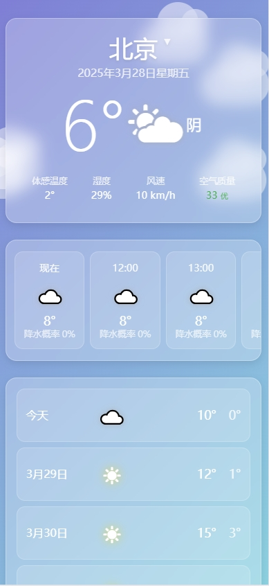
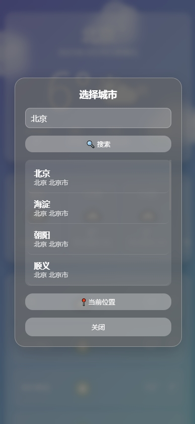
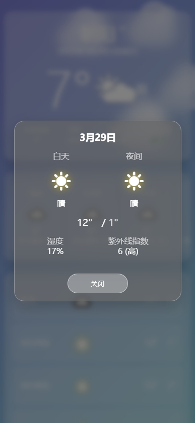

# 轻风天气 - 现代简约天气应用



轻风天气是一个现代、简约、美观的天气预报应用，提供实时天气、每小时预报和未来7天天气预测。应用采用响应式设计，在移动设备和桌面端均可流畅运行。

## ✨ 功能特性

- **实时天气信息**：温度、体感温度、湿度、风速和空气质量
- **每小时天气预报**：时间、天气图标和温度
- **7天天气预报**：日期、天气状况、最高温和最低温
- **城市搜索**：通过搜索框查找全球城市
- **地理位置检测**：自动获取当前位置的天气
- **离线模式**：网络中断时显示缓存的天气数据
- **自适应天气背景**：根据当前天气和时间自动调整页面背景
- **简洁现代界面**：采用iOS风格的半透明界面设计

## 🛠️ 技术栈

- 前端：HTML5、CSS3、JavaScript (ES6+)
- 后端：Node.js、Express
- API：和风天气 API
- 部署：支持各种虚拟主机或云平台

## 📋 安装步骤

1. **克隆仓库**

```bash
git clone https://github.com/mengsec123/lightwind-weather.git
cd lightwind-weather
```

2. **安装依赖**

```bash
npm install
```

3. **配置API密钥**

在 `config/api.js` 文件中替换和风天气API密钥：

```javascript
key: 'your-qweather-api-key-here'
```

> 你可以在 [和风天气开发平台](https://dev.qweather.com/) 注册并获取免费的API密钥

4. **启动应用**

```bash
node app.js
```

5. **访问应用**

打开浏览器，访问 `http://localhost:3000`

## 🔍 使用方法

- **查看当前位置天气**：点击"当前位置"按钮，允许位置访问权限
- **搜索城市**：点击城市名称，输入想要查询的城市，然后点击搜索或按回车键
- **查看每小时预报**：水平滑动"小时预报"区域查看更多时段的预报
- **查看未来7天预报**：在应用底部查看一周天气预测

## 🔌 API说明

本应用使用和风天气API获取气象数据：

- 实时天气：`/v7/weather/now`
- 24小时预报：`/v7/weather/24h` 
- 7天预报：`/v7/weather/7d`
- 空气质量：`/v7/air/now`
- 城市查询：`/v2/city/lookup`

API配置位于 `config/api.js` 文件中。

## 📁 项目结构

```
lightwind-weather/
│
├── app.js              # 应用入口文件
├── config/             # 配置文件目录
│   └── api.js          # API配置
├── controllers/        # 控制器
│   └── weather.js      # 天气数据控制器
├── public/             # 静态资源
│   ├── css/            # 样式文件
│   ├── js/             # JavaScript文件
│   └── images/         # 图像资源
├── services/           # 服务层
│   └── qweather.js     # 和风天气API服务
├── utils/              # 工具函数
│   ├── response.js     # 响应格式化
│   └── transform.js    # 数据转换工具
├── routes/             # 路由定义
│   └── index.js        # 主路由文件
├── index.html          # 主页面
└── README.md           # 项目文档
```

## 📱 屏幕截图

### 主界面


### 城市搜索


### 天气详情


## 🚀 未来计划

- [ ] 添加更多天气动画效果
- [ ] 支持多语言
- [ ] 添加天气通知
- [ ] 增加更多个性化设置
- [ ] 开发移动应用版本

## 🤝 贡献指南

1. Fork本项目
2. 创建您的特性分支 (`git checkout -b feature/AmazingFeature`)
3. 提交您的更改 (`git commit -m 'Add some AmazingFeature'`)
4. 推送到分支 (`git push origin feature/AmazingFeature`)
5. 开启一个Pull Request

## 📄 许可证

本项目采用 MIT 许可证 - 详情见 [LICENSE](LICENSE) 文件

## 📧 联系方式

如有任何问题或建议，请通过以下方式联系我：

- 邮箱：mengsec88@gmail.com
- GitHub：[Mengsec123](https://github.com/mengsec123)

---

### 致谢

特别感谢和风天气提供强大的天气API支持。

---

Made with ❤️ by [mengsec123] 
